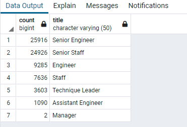
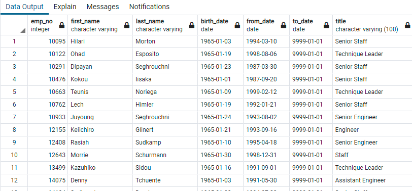
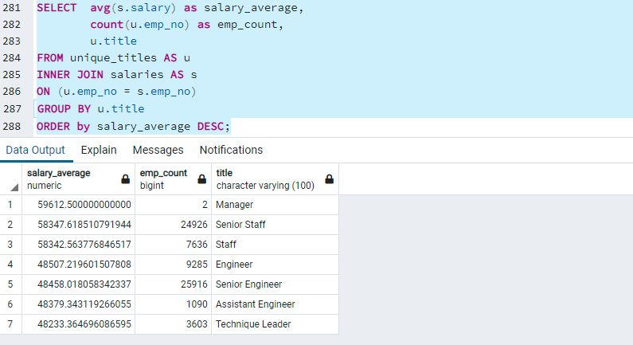
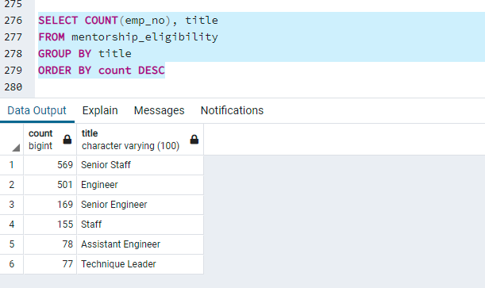

# Pewlett-Hackard-Analysis
# Module 7 Challenge- _Deliverable 3_

This written analysis contains three sections:

**1. Overview of the analysis**

**2. Results**

**3. Summary**
 
## 1. Overview of the analysis

The aim of the analysis was to help Bobby, who is a HR analyst at **Pewlett-Hackard**, determine the number of retiring employees per title, and identify employees who are eligible to participate in a mentorship program. Then, the analysis would summarize and help prepare Bobby’s manager for the “silver tsunami” as many current employees reach retirement age.

For the purposes of the analysis, multiple data tables were referenced in SQL thorugh *PostgreSQL* and *pgAdmin* to pull the required data by specific queries and finally exporting the resulting tables into `.csv` files. To perform the analysis, **six** files were used as input to review various aspects of an employee's time at **Pewlett-Hackard** including their titles, duration of employment, salaries and birth dates to come at the final conclusions. For context, the analysis involved reviewing over **300,000** employees who held over **440,000** titles at various stages of their career at Pewlett-Hackard.

## 2. Results

The results primarily highlight the four major points from,

### **a. Analysis to determine the number of retiring employees per title:**

The first analysis involved getting the total number of employees who would retire for each title group. This would help the HR department plan out the potential vacancies by each title at Pewlett-Hackard and start identifying the skill-sets that would be needed for the organization in the near future. The image below shares the number of current employees who were born between 1952 and 1955 grouped per their title.

*a. Potential Retirement by Title*



#### *i) Over 70,000 vacancies means almost 30% of the active workforce at Pewlett-Hackard would retire in the near term :*

It is clear from the number of potential retirees that Pewlett-Hackard faces a **real** crisis as almost a third of its active workforce would potentially retire in the short term. Thus Pewlett Hackard needs to look at talent mapping for those positions and potentially incentivize some part of the more critical workforce to retire later so that business continuity doesn't suffer.

#### *ii) Senior Engineer and Senior Staff would account for more than 70% of all potential vacancies due to retirement:*

Upon reviewing the image above, it is clear that two positions, **Senior Engineer and Senior Staff** would be the most at risk due to potential retirements in the near term. These two positions account for over 70% of all retirements meaning Pewlett-Hackard should start talent-planning for these specific skill sets either from within the organization or look at other options externally.

#### *iii) Managers don't seem to be under the risk of losing headcount due to retirement:*

From the chart above, it is clear that Managers are the least likely **(only 2 persons)** to lose headcount due to retirement and HR could exclude these group of employees from the analysis going forward.

### **b. Identify employees who are eligible to participate in a mentorship program:**

This analysis involved getting the mentorship-eligibility table that holds the current employees who were born between January 1, 1965 and December 31, 1965. The image below shows a snapshot of that list that includes over **1,500** employees.

*b. Mentorship Eligibility List*


#### *iv) The current criteria for Mentorship eligibility qualifies 1,500 candidates:*

The current criteria for mentorship eligibility qualifies only 1,500 candidates which may not be enough for Pewlett-Hackard given that over 70,000 employees would be nearing retirement soon. Thus the criteria can be relooked *(e.g. include a wider date range)* into to increase the pool of candidates for Mentorship programme to increase the scope of training and skill-sharing to help Pewlett-Hackard bridge the huge shortfall in talent that it faces due to retirements.
## 3. Summary

### a. How many roles will need to be filled as the "silver tsunami" begins to make an impact?

The results above clearly suggests that over **72,000** roles need to filled for the "silver tsunami". Of this, two positions, **Senior Engineer and Senior Staff** account for over 70% of all retirements while the first four titles of **Senior Engineer, Senior Staff, Engineer and Staff** account for nearly 95% of all potential vacancies.

If we add the Salaries of these roles to the analyses, we see that most of the openings are in the **upper-middle** salary range meaning that they are typically highly-skilled roles which would need more rigorous training or recruitment to backfill.

```
SELECT 	avg(s.salary) as salary_average,
		count(u.emp_no) as emp_count,
		u.title
FROM unique_titles AS u
INNER JOIN salaries AS s
ON (u.emp_no = s.emp_no)
GROUP BY u.title
ORDER by salary_average DESC;
```
*c. Openings by Salary*


### b. Are there enough qualified, retirement-ready employees in the departments to mentor the next generation of Pewlett Hackard employees?

As shared above, about 1,500 employees are eligible to mentor the next generation based on the current criteria which seems unlikely to bridge the potential talent gap of over 72,000 vacancies. Thus the criteria needs to be reviewed to potentially increase the number of mentors and also to align the skillsets of the mentors to the roles that would open up. 

If we group the `mentorship_eligibility.csv` file by title, we see that **Senior Engineers** are only about 10% *(169 out of 1549 mentors)* of all mentors while the number of vacancies for Senior Engineers are over 30% of the total. Thus more Senior Engineers should be drafted as Mentors to increase the skill-set in this area. The code to pull the grouping of mentors by titles is as follows:

```
SELECT COUNT(emp_no), title

FROM unique_titles

GROUP BY title

ORDER BY count DESC
```
*d. Mentorship by Title*



